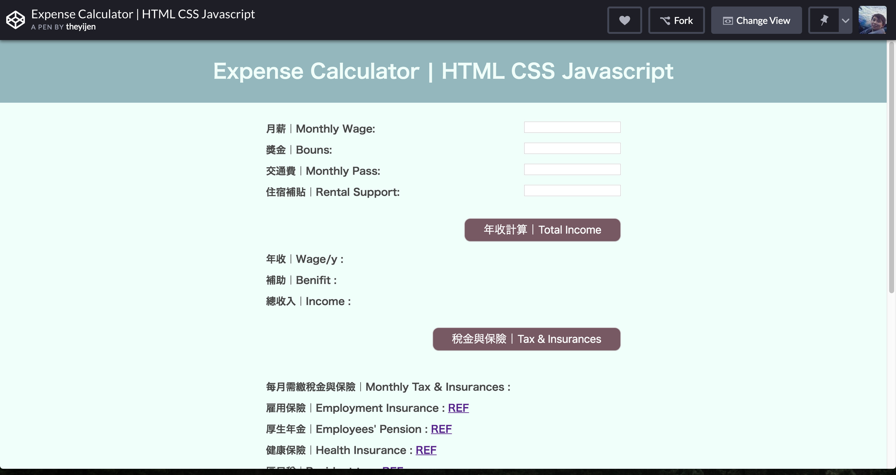

### Expense Calculator
An example javascript project, calculating living expenses if you work in Japan

## Link to the Project
* [codepen](https://codepen.io/theyij/pen/RwwbBrg) 

## Task
This is a project for learning how rgb color works and has a easy version with 3 options and hard version with 6 options.

## Function
This project provides random rgb color along with 5 other color for player to learn more about rgb color system.

## Tech Stack
* Javascript
* CSS
* DOM
* HTML
